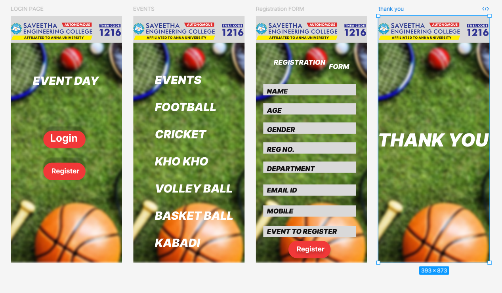

# Ex09 Event Registration Web Application
## Date:27/06/25

## AIM:
To design, develop and deploy a web application for event registration.

## DESIGN STEPS:

### Step 1:
Create a new frame.

### Step 2:
Select any one preset size of your choice.

### Step 3:
Select the shapes you need.

### Step 4:
Import images as needed.

### Step 5:
Create pages based on your need and link them.

### Step 6:

Validate the HTML and CSS code.

### Step 6:

Publish the website in the given URL.

## DESIGN TOOL:
Figma

## CODE:

LOGIN PAGE
```
<div style="width: 393px; height: 873px; position: relative; background: white; overflow: hidden">
  
  <div style="width: 149px; height: 62px; left: 115px; top: 406px; position: absolute; background: #F13838; box-shadow: 0px -15px 5px rgba(0, 0, 0, 0.25); border-radius: 100px"></div>
  <div style="width: 111px; height: 57px; left: 139px; top: 410px; position: absolute; color: white; font-size: 36px; font-family: Inter; font-weight: 700; word-wrap: break-word">Login</div>
  <div style="width: 149px; height: 62px; left: 115px; top: 519px; position: absolute; background: #F13838; box-shadow: 0px -18px 5px rgba(0, 0, 0, 0.25); border-radius: 100px"></div>
  <div style="width: 111px; height: 57px; left: 144px; top: 534px; position: absolute; color: white; font-size: 24px; font-family: Inter; font-weight: 700; word-wrap: break-word">Register</div>
  <div style="width: 393px; height: 95px; left: 0px; top: 0px; position: absolute; background: #D9D9D9"></div>
  <div style="left: 78px; top: 205px; position: absolute; color: white; font-size: 40px; font-family: Inter; font-style: italic; font-weight: 900; word-wrap: break-word">EVENT DAY</div>
  
</div>
```

EVENTS PAGE
```
<div style="width: 393px; height: 873px; position: relative; background: white; overflow: hidden">
  
  <div style="width: 393px; height: 95px; left: 0px; top: 0px; position: absolute; background: #D9D9D9"></div>
  
  <div style="left: 76px; top: 202px; position: absolute; color: white; font-size: 40px; font-family: Inter; font-style: italic; font-weight: 900; word-wrap: break-word">EVENTS<br/><br/>FOOTBALL<br/><br/>CRICKET<br/><br/>KHO KHO<br/><br/>VOLLEY BALL<br/><br/>BASKET BALL <br/><br/>KABADI</div>
  <div style="left: 300px; top: 320px; position: absolute; color: white; font-size: 40px; font-family: Inter; font-style: italic; font-weight: 900; word-wrap: break-word"><br/></div>
</div>

```

REGISTRATION PAGE
```
  <div style="width: 393px; height: 873px; position: relative; background: white; overflow: hidden">
  
  <div style="width: 393px; height: 95px; left: 0px; top: 0px; position: absolute; background: #D9D9D9"></div>
  
  <div style="left: 300px; top: 320px; position: absolute; color: white; font-size: 40px; font-family: Inter; font-style: italic; font-weight: 900; word-wrap: break-word"><br/></div>
  <div style="left: 63px; top: 150px; position: absolute; color: white; font-size: 24px; font-family: Inter; font-style: italic; font-weight: 900; word-wrap: break-word">REGISTRATION</div>
  <div style="left: 258px; top: 165px; position: absolute; color: white; font-size: 24px; font-family: Inter; font-style: italic; font-weight: 900; word-wrap: break-word">FORM</div>
  <div style="width: 327px; height: 40px; left: 26px; top: 241px; position: absolute; background: #D9D9D9"></div>
  <div style="left: 39px; top: 252px; position: absolute"><span style="color: #121111; font-size: 24px; font-family: Inter; font-style: italic; font-weight: 900; word-wrap: break-word">NA</span><span style="color: #1B1B1B; font-size: 24px; font-family: Inter; font-style: italic; font-weight: 900; word-wrap: break-word">ME</span></div>
  <div style="width: 327px; height: 40px; left: 26px; top: 309px; position: absolute; background: #D9D9D9"></div>
  <div style="left: 39px; top: 320px; position: absolute; color: #121111; font-size: 24px; font-family: Inter; font-style: italic; font-weight: 900; word-wrap: break-word">AGE</div>
  <div style="width: 327px; height: 40px; left: 26px; top: 377px; position: absolute; background: #D9D9D9"></div>
  <div style="width: 327px; height: 40px; left: 26px; top: 596px; position: absolute; background: #D9D9D9"></div>
  <div style="left: 39px; top: 607px; position: absolute"><span style="color: #121111; font-size: 24px; font-family: Inter; font-style: italic; font-weight: 900; word-wrap: break-word">NA</span><span style="color: #1B1B1B; font-size: 24px; font-family: Inter; font-style: italic; font-weight: 900; word-wrap: break-word">ME</span></div>
  <div style="left: 39px; top: 388px; position: absolute; color: #121111; font-size: 24px; font-family: Inter; font-style: italic; font-weight: 900; word-wrap: break-word">GENDER</div>
  <div style="width: 327px; height: 40px; left: 26px; top: 447px; position: absolute; background: #D9D9D9"></div>
  <div style="left: 39px; top: 458px; position: absolute; color: #121111; font-size: 24px; font-family: Inter; font-style: italic; font-weight: 900; word-wrap: break-word">REG NO.</div>
  <div style="width: 327px; height: 40px; left: 26px; top: 515px; position: absolute; background: #D9D9D9"></div>
  <div style="left: 39px; top: 526px; position: absolute; color: #121111; font-size: 24px; font-family: Inter; font-style: italic; font-weight: 900; word-wrap: break-word">DEPARTMENT</div>
  <div style="width: 327px; height: 40px; left: 26px; top: 596px; position: absolute; background: #D9D9D9"></div>
  <div style="left: 39px; top: 602px; position: absolute; color: #121111; font-size: 24px; font-family: Inter; font-style: italic; font-weight: 900; word-wrap: break-word">EMAIL ID</div>
  <div style="width: 327px; height: 40px; left: 26px; top: 670px; position: absolute; background: #D9D9D9"></div>
  <div style="left: 39px; top: 676px; position: absolute; color: #121111; font-size: 24px; font-family: Inter; font-style: italic; font-weight: 900; word-wrap: break-word">MOBILE</div>
  <div style="width: 327px; height: 40px; left: 26px; top: 742px; position: absolute; background: #D9D9D9"></div>
  <div style="left: 39px; top: 748px; position: absolute; color: #121111; font-size: 24px; font-family: Inter; font-style: italic; font-weight: 900; word-wrap: break-word">EVENT TO REGISTER</div>
  <div style="width: 149px; height: 62px; left: 115px; top: 795px; position: absolute; background: #F13838; box-shadow: 0px 8px 10px rgba(0, 0, 0, 0.25); border-radius: 100px"></div>
  <div style="width: 111px; height: 57px; left: 144px; top: 810px; position: absolute; color: white; font-size: 24px; font-family: Inter; font-weight: 700; word-wrap: break-word; text-shadow: 0px 8px 10px rgba(0, 0, 0, 0.25)">Register</div>
</div>


```


THANK YOU
```
<div style="width: 393px; height: 873px; position: relative; background: white; overflow: hidden">
  
  <div style="width: 393px; height: 95px; left: 0px; top: 0px; position: absolute; background: #D9D9D9"></div>
  
  <div style="left: -2px; top: 400px; position: absolute; color: white; font-size: 64px; font-family: Inter; font-style: italic; font-weight: 900; word-wrap: break-word">THANK YOU</div>
</div>

```

## OUTPUT:


## RESULT:
The program to design, develop and deploy a web application for event registration is completed successfully.
